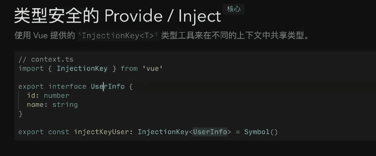
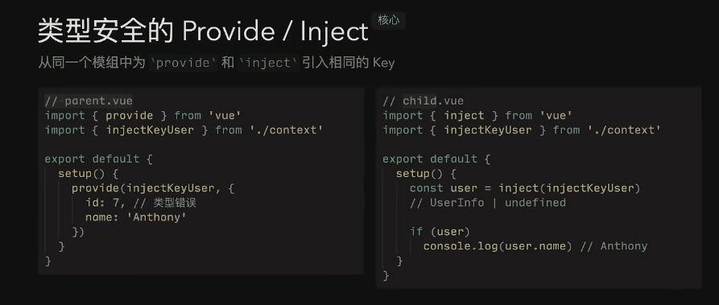

# 项目创建与模块安装

1. 使用vite构建vue3项目，安装vite

~~~
npm create vite@latest
~~~

2. 安装依赖，启动项目

~~~
npm install && npm run dev
~~~

3. 安装项目开发所需模块

* axios：`npm i axios`
* pinia：`npm i pinia`
* sass：`npm i sass`
* vue-router：`npm i vue-router@4`
* naive-ui：`npm i -D naive-ui` && `npm i -D vfonts`
* wangeditor：`npm i @wangeditor/editor-for-vue@next --save`

# 项目结构搭建

main.js中对开发所需的依赖进行引入

naive-ui组件库暂时使用全局引入，后期可优化为按需引入

配置`@/common/router.js`路由配置文件

## 引入pinia

`main.js`：

~~~js
import { createPinia } from "pinia"
...
app.use(createPinia());
~~~

## 配置项目路由

`@/common/router.js`（路由配置文件）：

~~~js
import { createRouter, createWebHashHistory } from "vue-router";

let routes = [
    { path: "/", component: () => import("../views/Test.vue") },
	...
];

const router = createRouter({
    history: createWebHashHistory(),
    routes,
})

export { router, routes };
~~~

`@/main.js`：

~~~js
import { router } from "./common/router";
...
app.use(router);
~~~

## 配置axios

用`e_commerce_platform`的封装方式封装了axios并创建了`api`文件夹管理接口

# 登录页面结构搭建

## 使用naive-ui组件库进行静态搭建

`template`：

~~~html
<template>
    

        /*
        	一个n-card进行布局，就相当于div，但是n-card有很多插槽，还有title之类的属性，可以给card内部的位置灵活插入内容
        */
        <n-card title="管理后台登录">
            /*
            	n-form就是表单，里面是n-from-item，n-from-item里面放置n-input
            	n-form的表单验证规则由rules属性决定，写rules时需要n-form-item的path属性对应具体的n-form-item
            */
            <n-form :rules="rules" :model="admin">
                <n-form-item path="account" label="账号">
                    <n-input v-model:value="admin.account" placeholder="请输入账号" />
                </n-form-item>
                <n-form-item path="password" label="密码">
                    <n-input v-model:value="admin.password" type="password" placeholder="请输入密码" />
                </n-form-item>
            </n-form>
            <template #footer>
                <n-checkbox v-model:checked="admin.rember" label="记住我" />
                <n-button>登录</n-button>
            </template>
        </n-card>
    

</template>
~~~

## provide全局提供封装的axios实例——requests

`main.js`：

~~~js
import requests from "./api/request";

app.provide("requests", requests);
~~~

`Login.vue`：

~~~js
const axios = inject("requests");
~~~

## 用pinia创建一个仓库用来保存管理员登录信息

`stores/AdminStore.js`：

其实就是用pinia提供的`defineStore`方法创建一个AdminStore，这是一个函数

~~~js
import { defineStore } from "pinia"

export const AdminStore = defineStore("admin", {
    state: () => {
        return {
            id: 0,
            account: "",
            token: "",
        }
    },
    actions: {},
    getters: {},
})
~~~

在组件中调用这个函数就可以获得仓库实例，从而访问仓库中的属性：

`Login.vue`：

~~~js
import { AdminStore } from "../../../client/src/stores/AdminStore";

const adminStore = AdminStore();
~~~

封装axios时在响应拦截器中原本是返回了`res.data`的，相当于只要我们服务端返回的数据，但是这样一修改axios返回的数据的结构，ts项目就会报错，因为axios返回的数据是由接口进行数据类型限制的，所以我又改成直接返回`res`了，这样我们访问服务端返回的数据还是得`res.data`（axios的响应拦截器接收的`res`其实是对服务端返回的数据的一个包装，`res.data`才是服务端返回的那个对象，当然我们服务端返回的那个对象里一般有`code` `data`等字段，所以以后我们拿到axios的返回结果`res`，要想拿到真实的服务端数据就得`res.data.data`）

## naive-ui使用全局api实现message提示信息

`main.js`：

~~~js
import { injectKeyMessage } from './context/context';
const { message, notification, dialog, loadingBar } = createDiscreteApi(['message', 'dialog', 'notification'])
app.provide(injectKeyMessage, message);
~~~

这里我们想把`message`这个玩意通过`app.provide`做一个全局提供，但是发现key如果为简单的一个字符串，子组件中`inject`拿到`message`使用（访问message对象的一些方法）时会报错，因为`provide`时没s指明`message`的类型，访问一些未知的属性，所以报类型错误。

解决方案：

创建了`src/context/context.ts`文件夹，用于存放provide变量时的key（Symbol类型的变量）

`Login.vue`：

~~~js
const message = inject(injectKeyMessage);

/*
	登录回调
*/
const login = async () => {
    let result = await reqLogin(admin);
    if(result.data.code === 200) {
        adminStore.token = result.data.data.token;
        adminStore.account = result.data.data.account;
        adminStore.token = result.data.data.token;
        message.info("登录成功");
    } else {
        message.error("登录失败");
    }
}
~~~

## 记住密码功能

借助本地存储即可

## 登录后路由转跳 && 拿到pinia仓库

`Login.vue`：

~~~js
import { useRouter, useRoute } from "vue-router";
const router = useRouter();

...

router.push("/dashboard");
~~~

`Dashboard.vue`：

~~~js
import { AdminStore } from "../../stores/AdminStore";
const adminStore = AdminStore();
~~~

# 后台框架搭建

左部为导航栏，通过遍历`menus`数组得到，右侧展示路由组件`Article.vue`或`Category.vue`

实现路由切换函数`toPage`