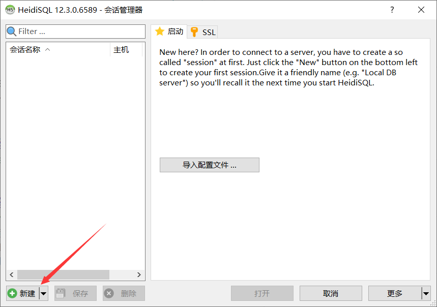
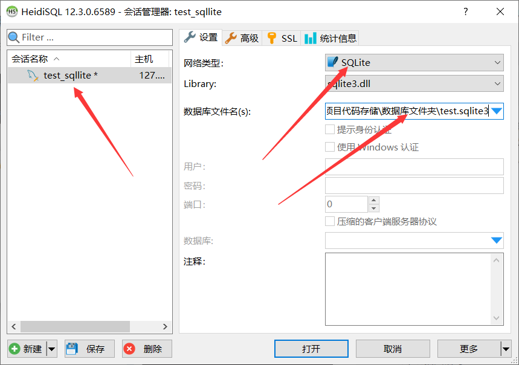
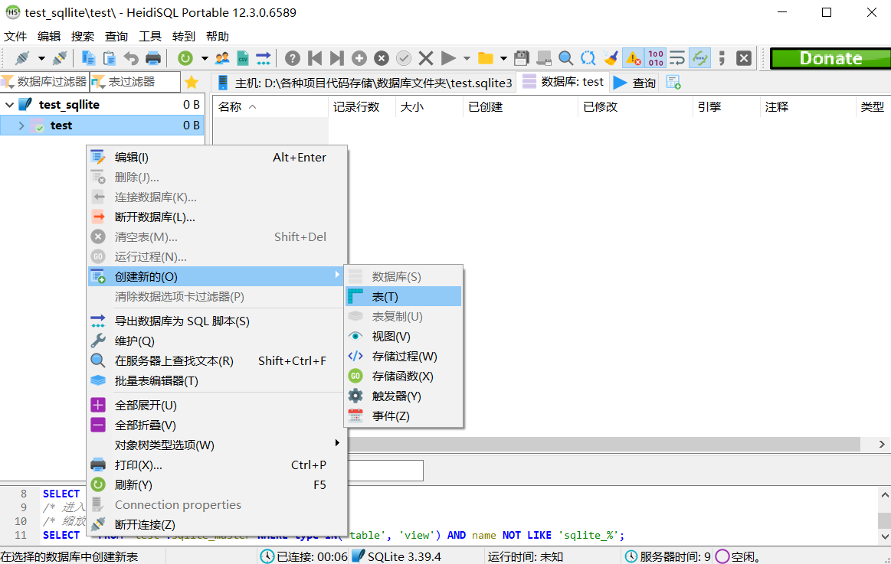
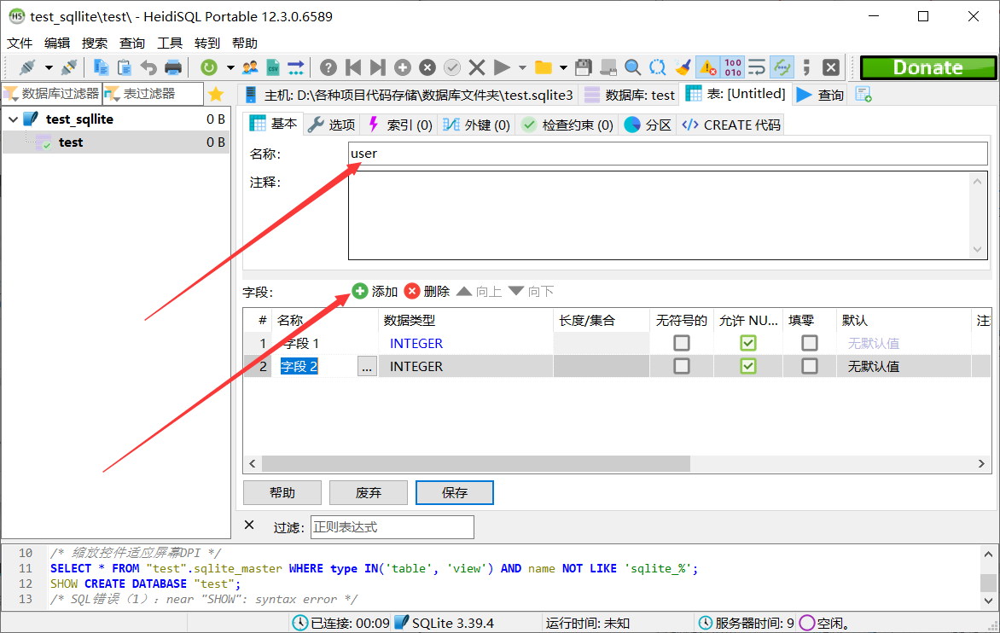
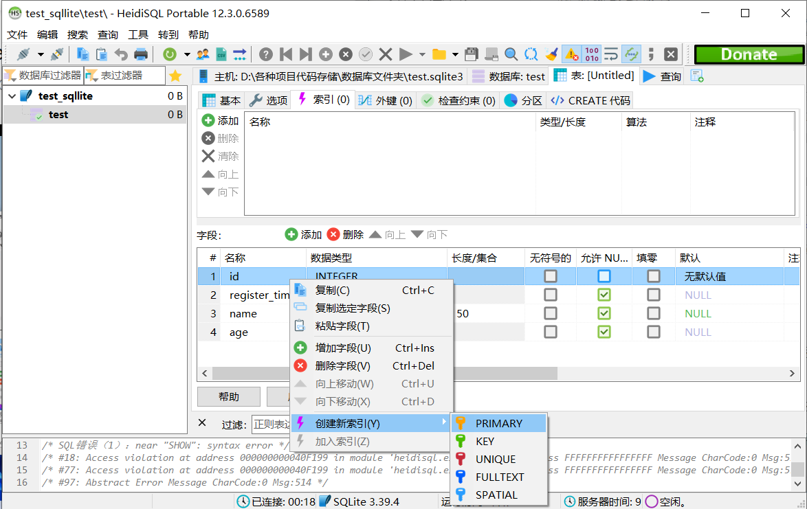
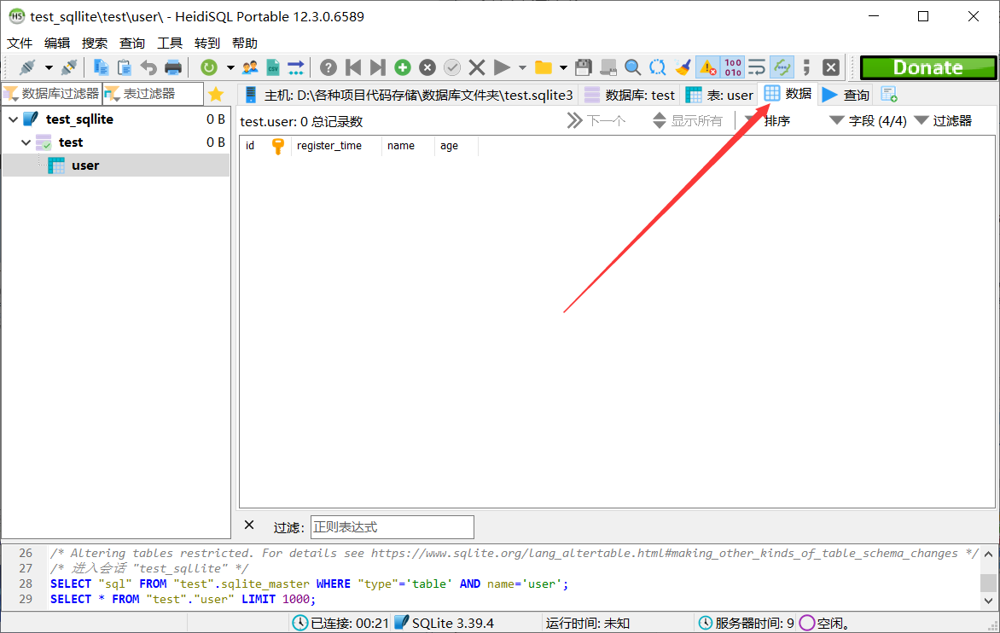
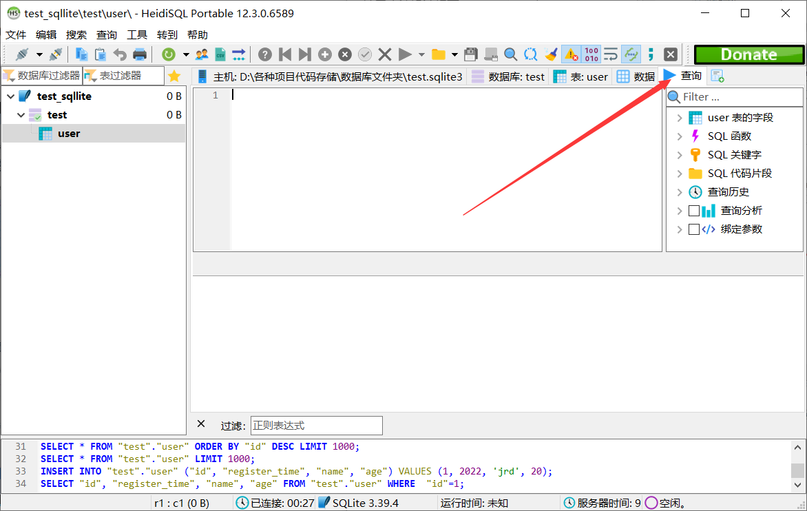

# express内置基础

1. express中的路由（方法+路径+回调）的路径部分其实也可以用类似于正则中的特殊符号进行多种情况的匹配：

~~~js
app.get("/ab(cd)?e", function() {
    res.send("abe or abcde")
})
~~~

2. `app.all("*", fn)`也类似于全局中间件

~~~js
app.use(function(req, res, next) => {
	req.requestTime = Date.now();
	next();
})

app.all("*", function(req, res, next) => {
	next();        
})

app.get("/", (req, res) => { ... })

// 请求"/"接口时，app.use、app.all、app.get依次执行
~~~

3. 开放跨域请求

~~~js
app.use(function (req, res, next) {
  //设置允许跨域的域名，*代表允许任意域名跨域
  res.header("Access-Control-Allow-Origin", "*");
  //允许的header类型
  res.header("Access-Control-Allow-Headers", "content-type");
  //跨域允许的请求方式
  res.header("Access-Control-Allow-Methods", "DELETE,PUT,POST,GET,OPTIONS");
  if (req.method == "OPTIONS") res.sendStatus(200); //让options尝试请求快速结束
  else next();
});
~~~

4. express自带中间件

* `express.json()`：使用之后路由回调的`req.body`里可以访问到前端传来的json数据，不然解析不到
* `express.static(url)`：托管url指定文件夹下的静态资源

比如服务器项目中有个public文件夹，里面存放了一些图片（test.png）,我们在项目中使用中间件：

~~~js
app.use(express.static(path.join(__dirname,"public")))
~~~

那么我们在浏览器就可以访问文件夹下的资源（服务端项目地址+文件夹下的资源名称即可，如localhost/test.png）

* `express.Router()`：模块化路由开发

router.js：

~~~js
const express = require("express");
var router = express.Router();

router.post(...)
            
router.get("/test", (req, res) => {
    ...
})

module.exports = router;
~~~

app.js：

~~~js
...

app.use("/router", require("router.js"));

...
~~~

这样我们就可以访问`/router/test`接口

# 文件上传与下载

1. 上传文件

安装上传文件中间件

~~~
npm install multer
~~~

使用中间件，配置文件上传临时目录

~~~js
const upload = multer({
  dest: "./public/upload/temp",
});
//所有接口都允许有上传功能
app.use(upload.any());
/*
	经过如上设置，前端传来的文件数据会自动存放在dest属性指定的文件夹下
*/
~~~

上传的接口代码：

~~~js
router.post("/upload", (req, res) => {
  //检测是否有文件
  if (!req.files) {
    res.send({
      code: 400,
      msg: "上传文件不能为空",
    });
    return;
  }
  
  //保存文件
  let files = req.files;
  let ret_files = []; // 存放文件名，作为返回给前端的数据
  for (let file of files) {
    //获取名字后缀
    let file_ext = file.originalname.substring(file.originalname.lastIndexOf(".") + 1);
    //使用时间戳作为文件名字
    let file_name = new Date().getTime() + "." + file_ext;
    /*
    	fs.renameSync(oldPath, newPath):移动文件并且修改文件名字
    */
    fs.renameSync(
      /*
      		process.cwd()是指项目运行的地址（__dirname是指当前文件所在地址）
      		这里用项目运行地址是因为这个文件上传路由是属于一个express.Router的，__dirname需要返回一层才能访问到public文件夹
      */
      process.cwd() + "/public/upload/temp/" + file.filename,
      process.cwd() + "/public/upload/" + file_name
    );
    ret_files.push("/public/upload/" + file_name);
  }

  res.send({
    code: 200,
    msg: "ok",
    data: ret_files,
  });
    
}
~~~

2. 文件下载

使用res.download()方法

~~~js
router.get("/download", async (req, res) => {
  let file_name = req.query.file_name;
  let file_path = process.cwd() + "/public/upload/" + file_name;
  res.download(file_path);
})
/*
	客户端传来一个文件名，就会下载服务器对应的那个文件
*/
~~~

# 接口方法设计规范

| 请求类型 | 描述         |
| :------- | :----------- |
| GET      | 读取（幂等） |
| POST     | 新增         |
| PUT      | 更新（幂等） |
| DELETE   | 删除（幂等） |

幂等性（idempotent、idempotence）：幂等是一个数学与计算机学概念，常见于抽象代数中。在编程中一个幂等操作的特点是执行多次或1次，其影响是相同的。

比如： GET：客户端请求多次或1次，对请求的资源产生的影响是相同； DELETE：删除多次或1次，其删除的数据范围都是相同的，影响是相同的; PUT：将A值更新为B值，执行多次其最终结果仍是B值；

在开发中如果不遵守RESTful API 的设计规范会把POST的职能由“新增”，扩展到支持“新增、更新、删除”。

# req的常用属性与方法

* req.baseUrl：获取基础路径
* req.body：获取body里面的内容（一般需要配合一些中间件对body里附带的数据进行解析）

* else：

  ~~~js
  var express = require('express')
  
  var app = express()
  
  // 请求路径 /test/hello?test=abc
  app.post('/test/:name', function (req, res, next) {
      console.log(req.hostname) // Host: "example.com:3000" =>  example.com
      console.log(req.ip) // 127.0.0.1
      console.log(req.method) // post
      console.log(req.originalUrl) // /test/hello?test=abc
      console.log(req.params.name) // hello
      console.log(req.path) // /test
      console.log(req.protocol) // https://example.com/ => https
      console.log(req.query.test) // abc
      res.send(req.route)
  })
  ~~~

# res的常用属性与方法

* res.download(path [, filename] [, options] [, fn])：下载文件

  * path：服务端（给客户端）的文件的路径
  * filename：客户端下载之后获得的文件名
  * fn：错误处理函数

  ~~~js
  res.download('/report-12345.pdf')
  
  res.download('/report-12345.pdf', 'report.pdf')
  
  res.download('/report-12345.pdf', 'report.pdf', function (err) {
    if (err) {
      // Handle error, but keep in mind the response may be partially-sent
      // so check res.headersSent
    } else {
      // decrement a download credit, etc.
    }
  })
  ~~~

* res.end：结束响应

  ~~~js
  res.end() // 没有东西返回，就不用res.send，直接res.end
  res.status(204).end() // 设置一个http状态码之后再结束
  ~~~

* res.redirect([status,] path)：重定向用户访问的url

  ~~~js
  res.redirect(301, 'http://example.com')
  res.redirect('../login')
  res.redirect('http://baidu.com')
  ~~~

* res.status(code)：设置响应的http的状态码

  ~~~js
  res.status(403).end()
  res.status(400).send('Bad Request')
  res.status(404).sendFile('/absolute/path/to/404.png')
  ~~~

# 使用heidiSQL（数据库管理工具）

1. 打开heidiSQL，新建数据库

2. 创建一个应用会话（随便起个名）;网络类型就是选择数据库，我们选择SQLite（特点就是轻量级，不用安装数据库软件）；指定一个数据库文件。点击左下保存按钮后，点击打开。

3. 建表 && 设置表名并添加字段（列信息）

plus——sqlite3基础数据类型：

| 存储类  | 描述                                                         |
| :------ | :----------------------------------------------------------- |
| INTEGER | 值是一个带符号的整数，根据值的大小存储在 1、2、3、4、6 或 8 字节中。 |
| REAL    | 值是一个浮点值，存储为 8 字节的 IEEE 浮点数字。              |
| TEXT    | 值是一个文本字符串，使用数据库编码（UTF-8、UTF-16BE 或 UTF-16LE）存储。 |
| BLOB    | 值是一个 blob 数据，完全根据它的输入存储。                   |

4. 设置主键（点击保存表就创建成功了）

5. 点击数据进入数据编辑页面

6. 点击查询进入sql语句执行控制台

# sql语句

## create建表

~~~sql
CREATE TABLE "user" (
    "id" BIGINT NOT NULL,
    "name" VARCHAR(50) NULL,
    "account" VARCHAR(50) NULL,
    "password" VARCHAR(50) NULL,
    "token" VARCHAR(50) NULL,
    "create_time" BIGINT NULL,
    "balance" BIGINT NULL,
    PRIMARY KEY ("id")
);
~~~

## Insert插入

~~~sql
INSERT INTO TABLE_NAME [(column1, column2, column3,...columnN)]  
VALUES (value1, value2, value3,...valueN);
~~~

~~~sql
INSERT INTO `user` (`id`,`name`,`account`,`password`,`create_time`,`balance`)
VALUES (1, 'Paul', 'testaccount01', '123456', 123456,100 );
~~~

## Select 查询语句

SQLite 的 SELECT 语句的基本语法：

~~~sql
SELECT column1, column2, columnN FROM table_name;
~~~

在这里，column1, column2...是表的字段，他们的值即是您要获取的。如果您想获取所有可用的字段，那么可以使用下面的语法：

~~~sql
SELECT * FROM table_name;
~~~

### where 条件查询

您还可以使用[比较或逻辑运算符](https://www.runoob.com/sqlite/sqlite-operators.html)指定条件，比如 >、<、=、LIKE、NOT，等等。

假设 user 表有以下记录：

|   id | name  | account       | password | token | create_time | balance |
| ---: | :---- | :------------ | :------- | :---- | ----------: | ------: |
|    1 | Paul  | testaccount01 | 123456   | \N    |      123456 |     100 |
|    2 | Allen | testaccount02 | abcdef   | \N    |      123456 |     200 |
|    3 | Teddy | testaccount03 | 654321   | \N    |      123456 |     300 |
|    4 | Mark  | testaccount04 | 666666   | \N    |      123456 |     400 |
|    5 | David | testaccount05 | 123456   | \N    |      123456 |     500 |

~~~sql
SELECT `id`,`name`,`password`,`balance` FROM `user` WHERE `balance` > 200;
~~~

|   id | name  | password | balance |
| ---: | :---- | :------- | ------: |
|    3 | Teddy | 654321   |     300 |
|    4 | Mark  | 666666   |     400 |
|    5 | David | 123456   |     500 |

 ~~~sql
SELECT * FROM `user` WHERE `balance` > 200 AND `balance` < 500;
 ~~~

|   id | name  | account       | password | token | create_time | balance |
| ---: | :---- | :------------ | :------- | :---- | ----------: | ------: |
|    3 | Teddy | testaccount03 | 654321   | \N    |      123456 |     300 |
|    4 | Mark  | testaccount04 | 666666   | \N    |      123456 |     400 |

### BETWEEN 查询

~~~sql
SELECT * FROM `user` WHERE `balance` BETWEEN 200 AND 500;
~~~

|   id | name  | account       | password | token | create_time | balance |
| ---: | :---- | :------------ | :------- | :---- | ----------: | ------: |
|    2 | Allen | testaccount02 | abcdef   | \N    |      123456 |     200 |
|    3 | Teddy | testaccount03 | 654321   | \N    |      123456 |     300 |
|    4 | Mark  | testaccount04 | 666666   | \N    |      123456 |     400 |
|    5 | David | testaccount05 | 123456   | \N    |      123456 |     500 |

~~~sql
SELECT * FROM `user` WHERE `balance` = 200 or `balance` = 500;
~~~

|   id | name  | account       | password | token | create_time | balance |
| ---: | :---- | :------------ | :------- | :---- | ----------: | ------: |
|    2 | Allen | testaccount02 | abcdef   | \N    |      123456 |     200 |
|    5 | David | testaccount05 | 123456   | \N    |      123456 |     500 |

### 模糊查询

~~~sql
SELECT * FROM `user` WHERE `name` LIKE 'a%';
~~~

|   id | name  | account       | password | token | create_time | balance |
| ---: | :---- | :------------ | :------- | :---- | ----------: | ------: |
|    2 | Allen | testaccount02 | abcdef   | \N    |      123456 |     200 |

~~~sql
SELECT * FROM `user` WHERE `name` LIKE '%a%';
~~~

|   id | name  | account       | password | token | create_time | balance |
| ---: | :---- | :------------ | :------- | :---- | ----------: | ------: |
|    1 | Paul  | testaccount01 | 123456   | \N    |      123456 |     100 |
|    2 | Allen | testaccount02 | abcdef   | \N    |      123456 |     200 |
|    4 | Mark  | testaccount04 | 666666   | \N    |      123456 |     400 |
|    5 | David | testaccount05 | 123456   | \N    |      123456 |     500 |

### in查询

~~~sql
SELECT * FROM `user` WHERE `id` IN (2,5);
~~~

|   id | name  | account       | password | token | create_time | balance |
| ---: | :---- | :------------ | :------- | :---- | ----------: | ------: |
|    2 | Allen | testaccount02 | abcdef   | \N    |      123456 |     200 |
|    5 | David | testaccount05 | 123456   | \N    |      123456 |     500 |

~~~sql
SELECT * FROM `user` WHERE `id` NOT IN (2,5);
~~~

|   id | name  | account       | password | token | create_time | balance |
| ---: | :---- | :------------ | :------- | :---- | ----------: | ------: |
|    1 | Paul  | testaccount01 | 123456   | \N    |      123456 |     100 |
|    3 | Teddy | testaccount03 | 654321   | \N    |      123456 |     300 |
|    4 | Mark  | testaccount04 | 666666   | \N    |      123456 |     400 |

### Limit 关键字

**LIMIT** 子句用于限制由 SELECT 语句返回的数据数量。

~~~sql
select * from `user` limit a,b
--从查询的结果集合中第a条数据开始取，取b条
--等价于：
select * from `user` limit b offset a
~~~

~~~sql
select * from `user` limit 2
select * from `user` limit 2,2
~~~

### Order By 关键字

`asc`是指定列按升序排列,`desc`则是指定列按降序排列

**ORDER BY** 子句是用来基于一个或多个列按升序或降序顺序排列数据。

~~~sql
select * from `user` order by `id` desc limit 3
select * from `user` order by `password`,`id` asc limit 3
~~~

### Distinct 关键字

**DISTINCT** 关键字与 SELECT 语句一起使用，来消除所有重复的记录，并只获取唯一一次记录。

~~~sql
select `password` from `user` 
select DISTINCT `password` from `user` 
~~~

## Update 语句

带有 WHERE 子句的 UPDATE 查询的基本语法如下：

~~~sql
UPDATE table_name
SET column1 = value1, column2 = value2...., columnN = valueN
WHERE [condition];
~~~

~~~sql
UPDATE `user` SET `account` = 'admin01',`password`='888888' WHERE `id` = 1;
~~~

## Delete 语句

带有 WHERE 子句的 DELETE 查询的基本语法如下：

~~~sql
DELETE FROM table_name
WHERE [condition];
~~~

~~~sql
DELETE FROM `user` WHERE `id` = 1;
~~~

# 索引

索引（Index）是一种特殊的查找表，数据库搜索引擎用来加快数据检索。简单地说，索引是一个指向表中数据的指针。一个数据库中的索引与一本书的索引目录是非常相似的。

## 创建索引

~~~sql
CREATE [UNIQUE] INDEX index_name ON table_name (column_name,column_name);

--单列索引
CREATE INDEX test_index ON `user` (`account`);

--唯一所以
CREATE UNIQUE INDEX test_index ON `user` (`account`);

--组合索引
CREATE INDEX test_index ON `user` (`account`,`name`);
~~~

## 查看索引

~~~sql
SELECT * FROM sqlite_master WHERE type = 'index';
~~~

## 删除索引

~~~sql
DROP INDEX test_index;
~~~

虽然索引的目的在于提高数据库的性能，但这里有几个情况需要避免使用索引。使用索引时，应重新考虑下列准则：

索引不应该使用在较小的表上。

索引不应该使用在有频繁的大批量的更新或插入操作的表上。

索引不应该使用在含有大量的 NULL 值的列上。

索引不应该使用在频繁操作的列上。

# 约束

约束是在创建表的时候，可以给表的字段添加相应的约束，添加约束的目的是为了保证表中数据的合法性、有效性、完整性。

常见的约束有：非空约束（not null）、唯一约束（unique）、主键约束（primary key）

- **NOT NULL 约束**
- **UNIQUE 约束**
- **PRIMARY Key 约束**

# 常用函数

官方文档

https://www.sqlite.org/lang_corefunc.html

| 序号 | 函数 & 描述                                     |
| :--- | :---------------------------------------------- |
| 1    | **COUNT 函数** COUNT 计算一个数据库表中的行数。 |
| 2    | **MAX 函数** MAX 选择某列的最大值。             |
| 3    | **MIN 函数** MIN 选择某列的最小值。             |
| 4    | **AVG 函数** AVG 计算某列的平均值。             |
| 5    | **SUM 函数** SUM 数值列计算总和。               |

例子:

~~~sql
SELECT count(*) FROM `user`
SELECT MAX(`id`) FROM `user`
SELECT AVG(`id`) FROM `user`

SELECT UPPER(`name`),random() FROM `user`
~~~

# 子查询

子查询或称为内部查询、嵌套查询，指的是在 SQLite 查询中的 WHERE 子句中嵌入查询语句

例子

~~~sql
select * from `user` where `id` in (select `id` from `user_log`)
select * from `user` where `id` in (select `id` from `user_log` where `login_times` > 5)
~~~

# 事务（Transaction）

说白了事务就是包含若干个sql语句，想保证这些sql语句要么全部执行，要么全部不执行（合并为一个执行整体对待）

事务 (`Transaction`) 是指作为单个逻辑工作单元执行的一系列操作，要么完全地执行，要么完全地不执行

事务处理可以确保除非事务性单元内的所有操作都成功完成，否则不会永久更新面向数据的资源

举个例子，A 向 B 转账 100 元，其实整个转账过程就是一个事务，要么转账成功了，A 的账户扣了 100 元，B 的账户增加了 100 元，要么转账失败，A 还是那么多钱，B 还是没钱，如果出现 A 扣了 100 元，B 的账户却没增加 100 元，那是要出问题的，是不？

事务，就是用来做这件事的，用来保证要么转账成功，要么转账失败

## 事务属性

事务可以用来维护数据库的完整性，保证成批的 SQL 语句要么全部执行，要么全部不执行

一般来说，事务是必须满足4个条件 ( ACID )

Atomicity(原子性)、Consistency(稳定性)、Isolation(隔离性)、Durability(可靠性)

1. **原子性**

   一组事务，要么成功；要么失败回滚当作什么事都没发生

2. **稳定性**

   有非法数据 (外键约束之类)，事务撤回

3. **隔离性**

   事务独立运行。一个事务处理后的结果，影响了其它事务，那么其它事务会撤回

   事务的100%隔离，需要牺牲速度

4. **可靠性**

   软、硬件崩溃后，SQLite 数据表驱动会利用日志文件重构修改

## SQLite 事务

SQLite 默认设置下，事务都是自动提交的，即执行 SQL 语句后就会马上执行 COMMIT 操作

因此要显式地开启一个事务务须使用命令 `BEGIN TRANSACTION`

SQLite 中可以使用下面的命令来控制事务

| 命令                   | 说明           |
| :--------------------- | :------------- |
| BEGIN TRANSACTION      | 开始事务处理。 |
| COMMIT END TRANSACTION | 保存更改       |
| ROLLBACK               | 回滚所做的更改 |

事务控制命令只与 DML 命令 INSERT、UPDATE 和 DELETE 一起使用

他们不能在创建表或删除表时使用，因为这些操作在数据库中是自动提交的

### BEGIN TRANSACTION 命令

事务 ( Transaction ) 可以使用 `BEGIN TRANSACTION` 命令或 `BEGIN` 命令来启动

~~~sql
BEGIN;
BEGIN TRANSACTION;
~~~

事务通常会持续执行下去，直到遇到下一个 `COMMIT` 或 `ROLLBACK` 命令

有个特殊情况是：在数据库关闭或发生错误时，事务处理会回滚

### COMMIT 命令

`COMMIT` 命令用于把事务调用的更改保存到数据库中

~~~sql
COMMIT;
END TRANSACTION;
~~~

### ROLLBACK 命令

`ROLLBACK` 命令是用于撤消尚未保存到数据库的事务

~~~sql
ROLLBACK;
~~~

例子：

~~~sql
--开启事务
BEGIN;

INSERT INTO `user` (`id`,`name`,`account`,`password`,`create_time`,`balance`)
VALUES (6, 'peter', 'testaccount01', '123456', 123456,100 );

--回滚事务
ROLLBACK;

--开启事务
BEGIN;

INSERT INTO `user` (`id`,`name`,`account`,`password`,`create_time`,`balance`)
VALUES (7, 'hello', 'testaccount01', '123456', 123456,100 );

--提交事务
COMMIT;
~~~

# 使用Node链接sqlite

安装sqlite3

运行命令

~~~
npm install sqlite3
~~~

链接数据库

~~~js
//导入模块
var sqlite3 = require("sqlite3").verbose();
//指定数据库文件位置
var db = new sqlite3.Database(__dirname + "/test.sqlite3");
~~~

执行插入、修改、删除语句，使用run方法

~~~js
let insert_sql = "INSERT INTO `user` (`id`,`name`,`account`,`password`,`create_time`,`balance`)
VALUES (?, ?, ?, ?, ?, ? );"
db.run(insert_sql, [6, 'peter', 'testaccount01', '123456', 123456,100],
function(err, rows){
    if(err == null){
        console.log("数据插入成功");
    }
});
~~~

执行查询语句，使用all方法

~~~js

db.all("SELECT * FROM `user` where `id` = ?", [1],(err,rows)={
    if(err == null){
        console.log("查询数据:",rows)
    }
});

db.all("SELECT * FROM `user`", [],(err,rows)={
    if(err == null){
        console.log("查询数据:",rows)
    }
});
~~~

